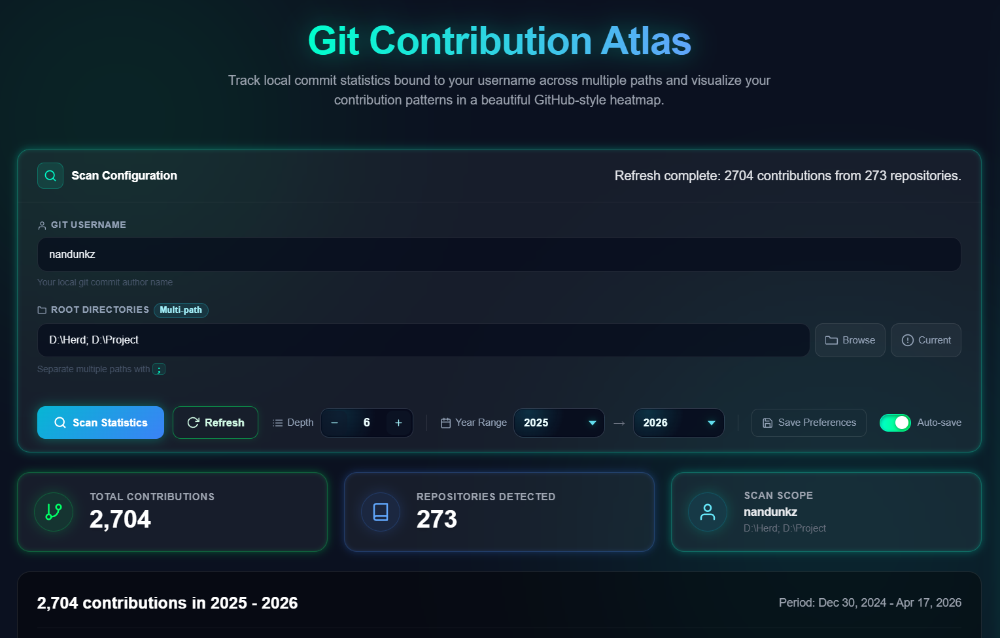

# Local Git Stat

Local Git Stat is a desktop app that scans your local Git repositories and turns raw commit history
into an easy-to-read contribution dashboard. It is designed for users who work across many projects
and want a clear activity overview without relying on cloud services.

All analysis runs locally on your machine.

## What You Can Do With It

- Scan one or many root folders to discover Git repositories automatically.
- Filter contribution analysis by a start and end year.
- Track commit activity for a specific username using name and email matching.
- View a GitHub-style heatmap plus detailed analytics for trends and consistency.
- Save preferences and quickly resume your last workflow.
- Load cached results instantly, then auto-refresh in the background when cache is stale.
- Cancel long scans at any time.
- Apply safe.directory fixes directly from the UI when Git reports ownership issues.

## Feature Details

### 1. Multi-root repository scanning

You can scan multiple root paths in one run. Separate paths with `;` in the input field.
The scanner recursively finds repositories and deduplicates overlapping paths.

### 2. Fast asynchronous processing

Repository scans run asynchronously with bounded parallelism, timeout handling, and cancellation support.
This keeps the app responsive while scanning large directory trees.

### 3. Advanced analytics dashboard

For the selected year range, the app computes and displays:

- Total contributions
- Repositories scanned
- Top repositories by commit share
- Current and longest streak
- Active day vs inactive day metrics
- Peak productivity day, week, and month
- Week-over-week growth
- 7-day moving average trend
- Weekday distribution and weekend ratio

### 4. Built-in cache and preference persistence

- Cached scan results are reused to speed up startup.
- Cache TTL is 20 minutes; stale cache triggers automatic refresh.
- Username, paths, year range, depth, and auto-save preference are persisted.

### 5. Safe directory issue handling

When Git blocks a repository because of dubious ownership, the app surfaces a one-click fix flow that
runs `git config --global --add safe.directory` for the affected paths.

## Compatibility Check (macOS and Linux)

Before enabling automatic packaging, the project was checked for cross-platform behavior:

- Windows-only process flags are isolated behind `cfg(windows)` in the Git process wrapper.
- Non-Windows builds use dedicated Unix-safe paths for root detection and path comparisons.
- Existing CI already runs Rust tests on Linux and macOS in addition to Windows.

Practical requirements for macOS and Linux users:

- Git must be installed and available in PATH.
- The selected folders must be accessible by your user account.
- If ownership warnings appear, use the in-app safe.directory fix tools.

## Supported Platforms

- Windows
- macOS
- Linux

## Installation

1. Open the Releases page: https://github.com/username/git-local-stat/releases
2. Download the latest package for your OS:
   - Windows: `.msi` or `.exe`
   - macOS: `.dmg` or `.app.tar.gz`
   - Linux: `.AppImage` or `.deb`
3. Run the installer and follow the on-screen steps.

Update the URL above with your real repository path after publishing.

## Quick Start

1. Open Local Git Stat.
2. Enter your Git username.
3. Choose one or more root paths (use `;` to separate multiple paths).
4. Set scan depth and year range.
5. Click Scan Statistics.
6. Review heatmap and analytics.
7. Use Refresh for manual updates or Cancel to stop a running scan.

## Automatic Packages and Releases On Push

This repository is configured to build release packages automatically for all major OS targets on
every push via GitHub Actions.

On each push, the pipeline will:

1. Build Tauri bundles for Windows, macOS, and Linux.
2. Upload per-platform artifacts to the workflow run.
3. Publish an automatic GitHub prerelease that includes all generated installers.

The autogenerated release tag format is:

- `auto-<branch-name>-<run-number>`

Generated assets include:

- Windows bundles (`.exe`, `.msi`)
- macOS bundles (`.dmg`, `.app.tar.gz`)
- Linux bundles (`.AppImage`, `.deb`)

## Troubleshooting

- "Git command not found": install Git and verify it is available from terminal.
- "Path not found" or "Path is not a directory": verify the selected folder still exists.
- Ownership warnings: use the in-app safe.directory fix buttons, then scan again.
- Empty results: verify your Git username input matches your commit author name/email.

## Privacy

Local Git Stat processes repository data locally and does not upload your commit history to external
services.

## Feedback and Issues

Report bugs or request features in the issue tracker:
https://github.com/nandunkz/git-local-stat/issues
